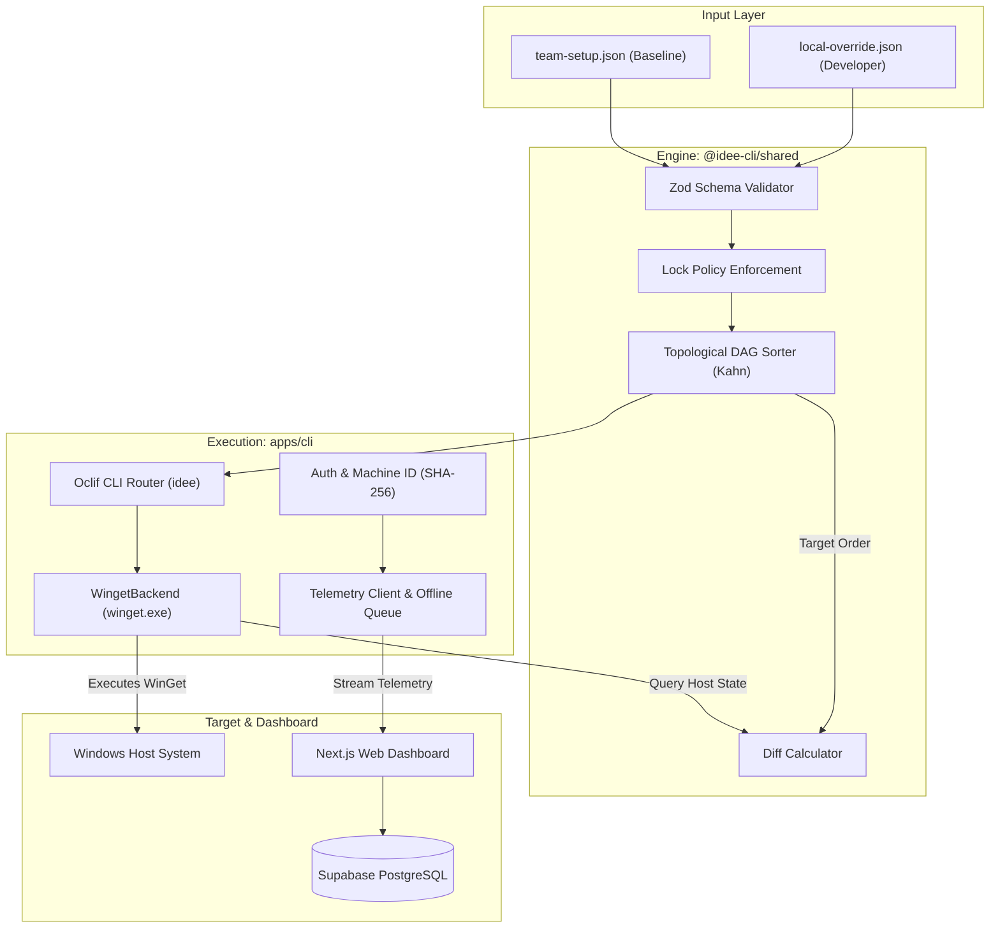
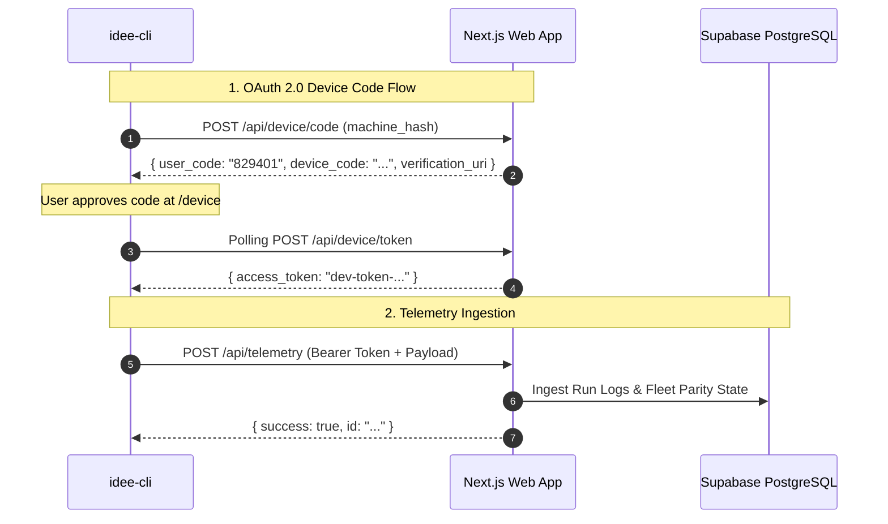

# ⚡ idee-cli

> **Windows-native CLI and full-stack telemetry dashboard for idempotent developer environment state reconciliation.**

[](https://turbo.build/)
[](https://www.typescriptlang.org/)
[](https://nodejs.org/)
[](https://nextjs.org/)
[](https://oclif.io/)
[](https://supabase.com/)
[](https://microsoft.com/windows)
[](LICENSE)

---

## 📖 Overview

**`idee-cli`** is an enterprise developer environment reconciliation engine designed for Windows engineering teams. It allows organizations to define baseline toolchains in declarative JSON manifests, resolve complex multi-tier package dependency graphs deterministically, and automatically reconcile missing host tools using the native Windows Package Manager (`winget`).

Every reconciliation cycle generates structured telemetry reports that stream into a central Next.js administrative dashboard, providing real-time fleet compliance metrics, execution audits, and security tracking across your entire engineering organization.

```
┌─────────────────────────────────────────────────────────────────────────────┐
│                            IDEE-CLI RECONCILIATION LOOP                     │
│                                                                             │
│   [team-setup.json] ──┐                                                     │
│                       ├─► [Pure Engine: Merge & Lock Enforcement]           │
│   [local-override] ───┘                         │                           │
│                                                 ▼                           │
│                                  [Kahn's DAG Topological Sort]              │
│                                                 │                           │
│                                                 ▼                           │
│   [WinGet Query Manifest] ◄──────── [Host Diff Calculator]                  │
│                                                 │                           │
│                                                 ▼                           │
│                                  [Sequential WinGet Installer]              │
│                                                 │                           │
│                                                 ▼                           │
│                                  [OAuth 2.0 / CI Telemetry Stream]          │
│                                                 │                           │
│                                                 ▼                           │
│                                  [Central Web Telemetry Dashboard]          │
└─────────────────────────────────────────────────────────────────────────────┘
```

---

## ✨ Key Features

- ⚡ **Idempotent Reconciliation Loop**: Audits host system against baseline specifications and installs only missing packages without redundant reinstalls.
- 🕸️ **DAG Topological Resolution**: Implements Kahn's algorithm to resolve complex dependency graphs with cycle detection and unresolved node isolation.
- 🔒 **Locked Baseline Security**: Prevents local developer overrides from modifying critical team versions or dependency chains designated as `"locked": true`.
- 🪟 **Native Windows Backend**: Deep integration with `winget.exe` for package query, export parsing, and silent unattended installations.
- 📊 **Central Telemetry Dashboard**: Next.js 14 App Router dashboard with fleet analytics, real-time run logs, service accounts, and device verification.
- 🔐 **OAuth 2.0 Device Code Flow**: RFC 8628-compliant browser authorization for developer workstations, paired with static service token support for CI/CD runners.
- 🛡️ **Offline Self-Recovery Queue**: Persists telemetry payloads to `%APPDATA%\idee-cli\telemetry-queue.json` during network outages and automatically flushes them upon reconnection.
- 🚀 **Dual Backend Architecture**: Out-of-the-box in-memory mode for instant zero-dependency local development, with seamless Supabase PostgreSQL & Upstash Redis production scale.

---

## 🏗 Architecture & Workspace Layout

`idee-cli` is managed as a high-performance monorepo using **Turborepo** and **npm workspaces**.



### Workspace Packages

| Package / App | Path | Description |
| :--- | :--- | :--- |
| **`apps/cli`** | [`apps/cli`](file:///r:/kyrell/Testing/idee-cli/apps/cli) | Oclif-powered command-line interface (`idee`) for inspecting, planning, auditing, and executing reconciliation loops. |
| **`apps/web`** | [`apps/web`](file:///r:/kyrell/Testing/idee-cli/apps/web) | Next.js 14 App Router web dashboard for fleet telemetry, device verification, and service token management. |
| **`packages/shared`** | [`packages/shared`](file:///r:/kyrell/Testing/idee-cli/packages/shared) | Core domain engine: Zod schemas, DAG topological sorter, config merger with lock enforcement, and diff calculator. |

---

## 🚀 Quickstart

### Prerequisites

- **Operating System**: Windows 10 (Build 1809+) or Windows 11 with `winget` installed.
- **Node.js**: `^22.0.0`
- **Package Manager**: `npm@10.x` or higher

### 1. Clone & Install

```powershell
# Clone the repository
git clone https://github.com/Hazy019/idee-cli.git
cd idee-cli

# Install dependencies across all workspaces
npm install

# Build all TypeScript packages
npm run build
```

### 2. Run Test Suite

```powershell
# Run all unit and integration test suites
npm run test
```

---

## 💻 CLI Command Reference (`idee`)

The CLI can be run using `npx idee` or directly via Node `node apps/cli/bin/run.js`.

### 1. `idee plan`
Calculates and displays the topological execution plan without performing any installations.

```powershell
# Human-readable plan
npx idee plan --config ./team-setup.json

# Output in machine-readable JSON
npx idee plan --config ./team-setup.json --json
```

**JSON Output Example:**
```json
{
  "executionQueue": [
    {
      "id": "Nodejs.Nodejs",
      "version": "22.0.0",
      "dependsOn": ["Git.Git"],
      "isOverride": false
    }
  ]
}
```

---

### 2. `idee audit`
Performs a read-only audit comparing target baseline requirements against currently installed WinGet packages on the host.

```powershell
# Human-readable audit report
npx idee audit --config ./team-setup.json

# Machine-readable JSON output
npx idee audit --config ./team-setup.json --json
```

**Sample Output:**
```text
======================================================
idee audit — Dev Environment Reconciliation Audit
======================================================

Target Packages Total: 3
Already Installed:     2
Missing Packages:       1

[Missing Packages to Install]
 - Nodejs.Nodejs @ 22.0.0
```

---

### 3. `idee apply`
Executes the reconciliation loop: installs missing packages in topological order via WinGet and streams execution telemetry to the central dashboard.

```powershell
# Standard reconciliation
npx idee apply --config ./team-setup.json

# Dry-run mode (computes plan without executing installs)
npx idee apply --config ./team-setup.json --dry-run

# Run without sending telemetry
npx idee apply --config ./team-setup.json --no-telemetry

# Custom dashboard endpoint
npx idee apply --config ./team-setup.json --dashboard-url http://localhost:3000
```

---

### 4. `idee login` & `idee logout`
Authenticates the CLI session with the central dashboard via OAuth 2.0 Device Flow.

```powershell
# Authenticate interactive session
npx idee login --dashboard-url http://localhost:3000

# Clear stored credentials
npx idee logout
```

---

### CLI Flags Summary Table

| Flag | Shorthand | Commands | Description | Default |
| :--- | :---: | :--- | :--- | :--- |
| `--config <path>` | `-c` | `plan`, `audit`, `apply` | Path to baseline `team-setup.json` | `./team-setup.json` |
| `--override <path>` | `-o` | `plan`, `audit`, `apply` | Path to `local-override.json` | `~/.ideefy/local-override.json` |
| `--json` | - | `plan`, `audit`, `apply` | Output structured JSON to stdout | `false` |
| `--dry-run` | - | `apply` | Simulate reconciliation without installing | `false` |
| `--no-telemetry` | - | `apply` | Skip telemetry transmission | `false` |
| `--dashboard-url <url>` | - | `apply`, `login` | Central dashboard endpoint URL | `http://localhost:3000` |

---

## 📝 Configuration File Specifications

### 1. Team Baseline Specification (`team-setup.json`)
The source of truth defined by team leads:

```json
{
  "version": "1.0",
  "name": "Engineering Team Baseline Environment",
  "packages": [
    {
      "id": "Git.Git",
      "name": "Git for Windows",
      "version": "2.45.0",
      "locked": true,
      "dependsOn": []
    },
    {
      "id": "Nodejs.Nodejs",
      "name": "Node.js LTS",
      "version": "22.0.0",
      "locked": true,
      "dependsOn": ["Git.Git"]
    },
    {
      "id": "Microsoft.VisualStudioCode",
      "name": "Visual Studio Code",
      "locked": false,
      "dependsOn": ["Nodejs.Nodejs"]
    }
  ]
}
```

### 2. Local Developer Override (`local-override.json`)
Developers can customize their local environments by creating `~/.ideefy/local-override.json`:

```json
{
  "version": "1.0",
  "packages": [
    {
      "id": "Docker.DockerDesktop",
      "name": "Docker Desktop"
    },
    {
      "id": "Microsoft.VisualStudioCode",
      "version": "1.90.0"
    }
  ]
}
```

> 🔒 **Locked Field Safeguard**: If a baseline package specifies `"locked": true`, attempting to override its `version` or `dependsOn` fields in `local-override.json` throws a `LockedFieldViolationError` and fails fast before any execution begins.

---

## 🌐 Web Telemetry Dashboard Setup

The Next.js web application provides administrative visibility, telemetry aggregation, device verification, and service token generation.



### Option A: Zero-Dependency In-Memory Mode (Instant Setup)
`apps/web` includes an active in-memory store and rate-limiting system that works out of the box with **no external database or Redis required**:

```powershell
cd apps/web
npm run dev
```
Open **`http://localhost:3000`** in your browser to view the live dashboard and approve device logins at `/device`.

---

### Option B: Cloud Supabase & Upstash Redis Setup (Production)
For persistent multi-tenant PostgreSQL storage:

1. Create a `.env.local` file in `apps/web`:
   ```env
   NEXT_PUBLIC_SUPABASE_URL=https://your-project.supabase.co
   NEXT_PUBLIC_SUPABASE_ANON_KEY=your_supabase_anon_key
   SUPABASE_SERVICE_ROLE_KEY=your_supabase_service_role_key
   UPSTASH_REDIS_REST_URL=https://your-redis.upstash.io
   UPSTASH_REDIS_REST_TOKEN=your_upstash_token
   ```

2. Apply migrations located at [`apps/web/supabase/migrations/00001_initial_schema.sql`](file:///r:/kyrell/Testing/idee-cli/apps/web/supabase/migrations/00001_initial_schema.sql).

3. Seed initial database data:
   ```powershell
   npm run seed
   ```

---

## 🤖 CI/CD Integration (GitHub Actions)

To enforce developer environment compliance in automated CI pipelines:

```yaml
name: Dev Environment Compliance Audit

on:
  push:
    branches: [main]
  pull_request:
    branches: [main]

jobs:
  audit-environment:
    runs-on: windows-latest
    steps:
      - name: Checkout Repository
        uses: actions/checkout@v4

      - name: Setup Node.js
        uses: actions/setup-node@v4
        with:
          node-version: 22

      - name: Install Monorepo Dependencies
        run: npm ci

      - name: Build Packages
        run: npm run build

      - name: Validate Dependency Graph & Plan
        run: npx idee plan --config ./team-setup.json --json

      - name: Perform Host Audit
        run: npx idee audit --config ./team-setup.json --json

      - name: Reconcile in CI Mode
        env:
          IDEE_SERVICE_TOKEN: ${{ secrets.IDEE_SERVICE_TOKEN }}
          IDEE_DASHBOARD_URL: ${{ secrets.IDEE_DASHBOARD_URL }}
        run: npx idee apply --config ./team-setup.json --dry-run
```

---

## 🛠 Troubleshooting & WinGet Reference

| Error / Exit Code | Cause | Resolution |
| :--- | :--- | :--- |
| `0x8920000B` / `-1978335189` | Package is already installed on Windows host. | Treated as non-fatal success by reconciliation engine. |
| `0x8920000C` / `-1978335188` | Package ID not found in WinGet configured sources. | Verify package ID against `winget search <id>`. |
| `0x89200004` / `-1978335228` | Source or package agreement requires acceptance. | Handled automatically via `--accept-source-agreements`. |
| `3010` / `1641` | Reboot required to finalize package setup. | Windows installer succeeded; restart system when convenient. |
| `LockedFieldViolationError` | Local override tried to alter locked field. | Remove modified locked fields from `local-override.json`. |
| `CircularDependencyError` | Dependency loop detected in configuration. | Resolve circular references listed in error output. |

---

## 📜 Monorepo Development Scripts

Run scripts from the repository root:

```powershell
# Compile all workspaces (shared, CLI, web)
npm run build

# Run unit tests across all packages
npm run test

# Launch development servers concurrently
npm run dev

# Run ESLint validation
npm run lint
```

---

## 📄 License

Distributed under the **MIT License**. See [`LICENSE`](file:///r:/kyrell/Testing/idee-cli/LICENSE) for details.
