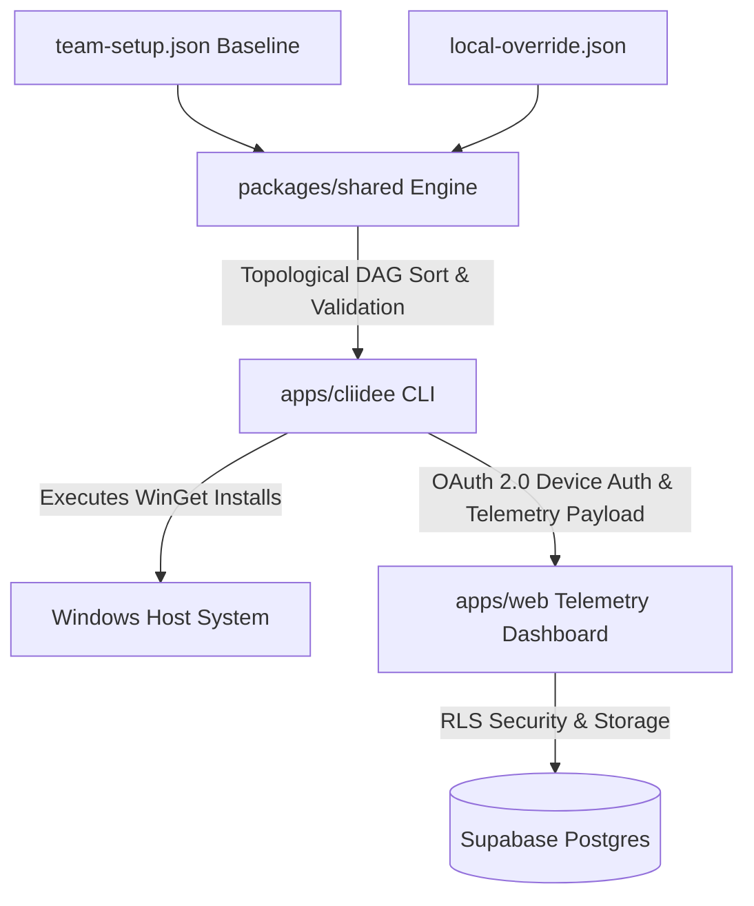

# ⚡ idee-cli

> **Windows-native CLI and full-stack telemetry dashboard for idempotent developer environment state reconciliation.**

[](https://turbo.build/)
[](https://www.typescriptlang.org/)
[](https://nodejs.org/)
[](https://nextjs.org/)
[](https://oclif.io/)
[](https://supabase.com/)
[](https://microsoft.com/windows)
[](LICENSE)

---

## 📖 Overview

**`idee-cli`** is an enterprise-grade developer environment reconciliation engine designed for Windows engineering teams. It allows organizations to define baseline environment specifications in JSON, resolve package dependency trees deterministically, and automatically reconcile missing host dependencies using the native Windows Package Manager (`winget`).

Every reconciliation cycle generates structured telemetry reports that stream into a central Next.js dashboard, providing real-time fleet compliance metrics, execution audits, and security tracking across your entire engineering team.

---

## ✨ Key Features

- ⚡ **Idempotent Reconciliation Loop**: Audits host system against baseline specifications and missing packages without unnecessary reinstalls.
- 🕸️ **DAG Topological Resolution**: Uses Kahn's algorithm to resolve complex package dependency graphs, detecting circular dependencies before execution starts.
- 🔒 **Locked Baseline Security**: Prevents local developer overrides from modifying critical team versions or dependency structures locked by leads.
- 🪟 **Native Windows Backend**: Deep integration with `winget` CLI for installation execution and status querying.
- 📊 **Central Telemetry Dashboard**: Next.js 14 web dashboard powered by Supabase RLS and Upstash Redis rate-limiting for enterprise visibility.
- 🔐 **OAuth 2.0 Device Auth**: Secure CLI authentication to dashboard via OAuth 2.0 Device Code Flow.

---

## 🏗 Architecture & Workspace Layout

`idee-cli` is managed as a high-performance monorepo using **Turborepo** and **npm workspaces**.



### Packages & Applications

| Package / App | Path | Description |
| :--- | :--- | :--- |
| **`apps/cli`** | [`apps/cli`](file:///r:/kyrell/Testing/idee-cli/apps/cli) | Oclif-powered command-line interface (`idee`) for inspecting, planning, and executing reconciliation loops. |
| **`apps/web`** | [`apps/web`](file:///r:/kyrell/Testing/idee-cli/apps/web) | Next.js 14 App Router web dashboard for authentication, device management, and telemetry analytics. |
| **`packages/shared`** | [`packages/shared`](file:///r:/kyrell/Testing/idee-cli/packages/shared) | Core domain engine: Zod schemas, DAG topological sorter, config merger with lock enforcement, and diff calculator. |

---

## 🚀 Quickstart

### Prerequisites

- **OS**: Windows 10/11 with `winget` installed.
- **Node.js**: `^22.0.0`
- **Package Manager**: `npm@10.9.7`

### Installation & Setup

1. **Clone the Repository**
   ```powershell
   git clone https://github.com/Hazy019/idee-cli.git
   cd idee-cli
   ```

2. **Install Dependencies**
   ```powershell
   npm install
   ```

3. **Build the Monorepo**
   ```powershell
   npm run build
   ```

---

## 💻 CLI Usage (`idee`)

The CLI binary is named `idee`. You can invoke commands directly through npm or by linking the CLI locally.

### 1. `idee plan` — Topological Execution Plan
Inspects the baseline environment and computes the topological dependency order without installing packages.

```powershell
# Print human-readable execution queue
npx idee plan --config ./team-setup.json

# Output in JSON format
npx idee plan --config ./team-setup.json --json
```

### 2. `idee audit` — Host Environment Audit
Performs a read-only audit comparing target package baseline requirements against currently installed WinGet packages.

```powershell
npx idee audit --config ./team-setup.json
```

### 3. `idee apply` — Reconciliation Execution Loop
Executes package installation in dependency order for any missing packages and submits telemetry reports.

```powershell
# Execute reconciliation loop
npx idee apply --config ./team-setup.json

# Dry-run mode (calculates plan without installing)
npx idee apply --config ./team-setup.json --dry-run

# Skip telemetry transmission
npx idee apply --config ./team-setup.json --no-telemetry
```

### 4. `idee login` & `logout` — Telemetry Authentication
Authenticates the local CLI session with the central dashboard via OAuth 2.0 Device Code Flow.

```powershell
# Authenticate session
npx idee login --dashboard-url http://localhost:3000

# Clear stored credentials
npx idee logout
```

---

## 📝 Configuration File Specifications

### Team Baseline (`team-setup.json`)
The baseline specification file defines target packages, exact versions, locking policies, and dependency relationships.

```json
{
  "version": "1.0",
  "name": "Engineering Team Baseline Environment",
  "packages": [
    {
      "id": "Git.Git",
      "name": "Git for Windows",
      "version": "2.45.0",
      "locked": true,
      "dependsOn": []
    },
    {
      "id": "Nodejs.Nodejs",
      "name": "Node.js LTS",
      "version": "22.0.0",
      "locked": true,
      "dependsOn": ["Git.Git"]
    },
    {
      "id": "Microsoft.VisualStudioCode",
      "name": "Visual Studio Code",
      "locked": false,
      "dependsOn": ["Nodejs.Nodejs"]
    }
  ]
}
```

### Local Developer Override (`local-override.json`)
Developers can customize their local environments by creating a `local-override.json` file. 

```json
{
  "version": "1.0",
  "packages": [
    {
      "id": "Docker.DockerDesktop",
      "name": "Docker Desktop"
    }
  ]
}
```

> ⚠️ **Locked Field Safeguard**: If a baseline package has `"locked": true`, attempting to override its `version` or `dependsOn` fields in `local-override.json` will trigger a `LockedFieldViolationError` and fail fast before execution.

---

## 🌐 Web Telemetry Dashboard Setup

The Next.js web application provides administrative visibility and telemetry ingestion.

1. **Navigate to Web Workspace**
   ```powershell
   cd apps/web
   ```

2. **Configure Environment Variables**
   Create `.env.local` in `apps/web`:
   ```env
   NEXT_PUBLIC_SUPABASE_URL=your_supabase_url
   NEXT_PUBLIC_SUPABASE_ANON_KEY=your_supabase_anon_key
   SUPABASE_SERVICE_ROLE_KEY=your_supabase_service_role_key
   UPSTASH_REDIS_REST_URL=your_upstash_url
   UPSTASH_REDIS_REST_TOKEN=your_upstash_token
   ```

3. **Start Development Dashboard**
   ```powershell
   npm run dev
   ```

4. **Verify Database Security & Seeding**
   ```powershell
   # Seed mock telemetry data
   npm run seed

   # Verify Row Level Security (RLS) policies
   npm run test
   ```

---

## 🛠 Monorepo Workflow Commands

Run all pipeline tasks across workspaces using Turborepo from the repository root:

```powershell
# Build all workspaces (shared library, CLI, web app)
npm run build

# Run test suites across all packages
npm run test

# Launch dev mode concurrently
npm run dev

# Run linter
npm run lint
```

---

## 📄 License

Distributed under the **MIT License**. See [`LICENSE`](file:///r:/kyrell/Testing/idee-cli/LICENSE) for details.
